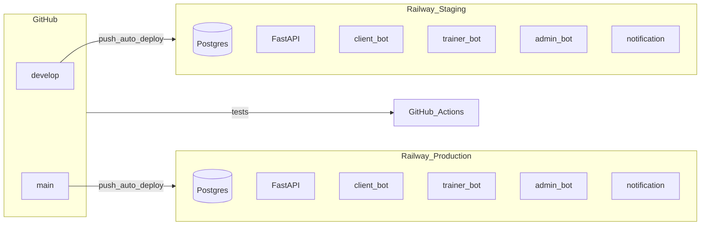

# CI/CD: GitHub + Railway

Краткая схема: **GitHub Actions** гоняет тесты; **Railway** сам деплоит код при пуше в привязанную ветку. Отдельный workflow с Railway CLI не обязателен, если устраивает встроенная интеграция GitHub → Railway.

## Компоненты на окружение

Один проект Railway (staging или production):

| Компонент | Роль |
|-----------|------|
| PostgreSQL | Managed database add-on |
| Web (FastAPI) | `Procfile` → миграции + `uvicorn` |
| client-bot | `python -m src.bot.client_app` |
| trainer-bot | `python -m src.bot.trainer_app` |
| admin-bot | `python -m src.bot.admin_app` |
| notification-service | `python -m src.bot.notification_service` |

Детали команд и переменных: **[RAILWAY_DEPLOY.md](RAILWAY_DEPLOY.md)**.

## Ветки и два проекта Railway

Рекомендуется **два проекта** Railway с одним и тем же репозиторием:

| Проект Railway | Ветка Git | Назначение |
|----------------|-----------|------------|
| Например `trainer-crm-staging` | `develop` (или `staging`) | Предпрод, тестовые боты |
| Например `trainer-crm-production` | `main` (или `master`) | Продакшен |

У каждого проекта — **своя** PostgreSQL и **свой** набор Variables (токены ботов, `API_BASE_URL`, S3). Так staging и prod изолированы.

## GitHub Actions

Файл: [`.github/workflows/tests.yml`](../.github/workflows/tests.yml).

- Запускается на push и pull request в ветки **`main`**, **`master`**, **`develop`**, **`staging`**.
- Шаги: установка зависимостей, PostgreSQL service container, `alembic upgrade head`, `pytest`.

Цель — не допускать очевидно сломанный код в целевых ветках; деплой по-прежнему делает Railway после успешного пуша (тесты не блокируют Railway автоматически, если не настроить branch protection — см. ниже).

### Усиление безопасности на `main` (опционально)

- В GitHub: **Settings → Branches → Branch protection rules** для `main`: required status check **Tests**, запрет прямых пушей, обязательный PR.
- Отдельный деплой только после зелёных тестов можно добавить позже (Railway CLI / Deploy Hook в workflow) — см. комментарии в конце этого файла.

## Чеклист: первичная настройка в Railway (вручную)

Выполняется в [railway.app](https://railway.app) для **каждого** окружения (staging и production отдельно).

### Staging

1. **New Project** → подключить GitHub-репозиторий.
2. В настройках деплоя указать ветку **`develop`** (или `staging`).
3. **Add Service → Database → PostgreSQL**.
4. Убедиться, что первый сервис (web) использует **Procfile** / `sh scripts/railway-start-api.sh`; при необходимости задать Custom Start Command.
5. Добавить **четыре** сервиса из того же репо с командами из [RAILWAY_DEPLOY.md](RAILWAY_DEPLOY.md) (три бота + `notification-service`).
6. Для каждого сервиса приложения: **Variables → Reference** на `DATABASE_URL` от PostgreSQL проекта.
7. Заполнить **staging**-токены ботов (отдельные боты в BotFather), `API_BASE_URL` на публичный URL **staging** API, остальное по таблице в RAILWAY_DEPLOY.

### Production

Повторить ту же структуру сервисов для проекта с веткой **`main`**, с **продакшен**-токенами и **продакшен** URL.

### Безопасность

- Не коммитить секреты; только Railway Variables / GitHub Secrets.
- Разные Telegram-боты и при необходимости разные S3 bucket/префиксы для staging и prod.
- Ограничить доступ к production-проекту в Railway (команда, 2FA).

## Дальнейшие улучшения (по желанию)

- Workflow `deploy` после успешных тестов через **Railway CLI** (`RAILWAY_TOKEN` в GitHub Secrets) или **Deploy Hook** — если нужен строгий gate «тесты → деплой» в одном pipeline.
- `Dockerfile` — только если Nixpacks перестанет устраивать.
