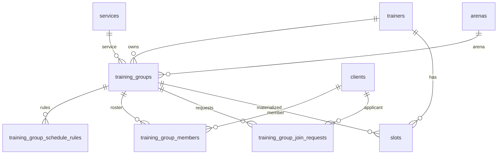

# Когорты (training groups)

Внутренняя справка по разделу «Группы»: домен, связь со слотами и очередь развития.

## Статусы жизненного цикла

| Код | Смысл |
|-----|--------|
| `draft` | Черновик |
| `recruiting` | Открыт набор (каталог может показывать при `catalog_visible`) |
| `active` | Идёт без набора |
| `paused` | Пауза |
| `archived` | Архив; будущие слоты группы отменяются по правилам use case |

Переходы в MVP задаются через API (`PATCH`); жёсткий state machine на БД не обязателен.

## ERD (упрощённо)

Ключевой внешний ключ: `slots.training_group_id` — слоты, порождённые когортой, помечаются и не удаляются вручную из редактора расписания.

## Синхронизация с расписанием

- **Источник правды по времени/месту для когорты:** строки в `training_group_schedule_rules` (день недели 0=пн … 6=вс, `start_time`, `duration_minutes`) плюс `season_start_date` при необходимости.
- **Материализация:** `materialize_slots_for_group` создаёт строки в `slots` с `training_group_id`, `capacity = max_members`, теми же `service_id` / `arena_id`, что у группы, на горизонте `SLOT_HORIZON_WEEKS` (по умолчанию 8 недель вперёд).
- **Серийные изменения / отмены (MVP):** смена правил или архивация — через use case’ы группы; «исключить один день» без отдельной сущности исключений в MVP не моделируется — при необходимости отмена конкретного слота вручную в БД/админке или фаза B.
- **Редактор расписания:** создание групповых слотов и шаблонов с ёмкостью &gt; 1 отключено; слоты когорты отображаются с подсказкой «Группа: …», переход в мини-приложение «Группы».

## Публичный каталог

- `GET /api/public/trainers/{id}/training-groups` — группы в статусе `recruiting`, с `catalog_visible`, с незаполненным ростером (по `seated_count`).
- Клиент: `POST /api/webapp/client/training-groups/{id}/join-request` с Telegram `initData`.

## RSVP «кто придёт»

- Таблица `group_attendance_prompts`, цикл в `notification_service` (клиентский бот). Интервал: env `GROUP_ATTENDANCE_PROMPT_HOURS` (см. `docs/ENVIRONMENT.md`); без значения — выключено.
- «Буду» создаёт подтверждённую запись (`bookings`, как запись тренера); занятость слота — как у обычных групповых броней.

## Фаза B (очередь)

- Посещаемость по датам.
- Лист ожидания как отдельный UX поверх `training_group_members.status = waitlist`.
- Массовые отмены / перенос серии (диапазон дат).
- Авторассылки и напоминания (шаблоны бота).
