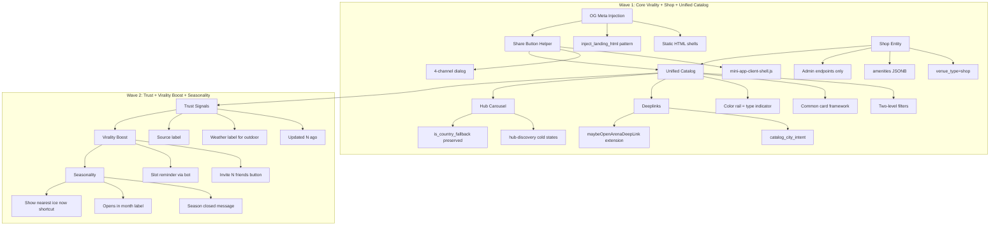
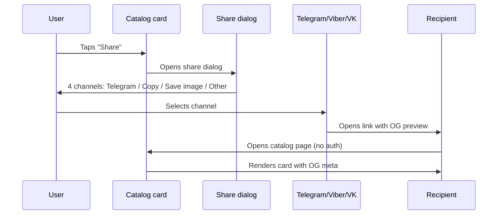
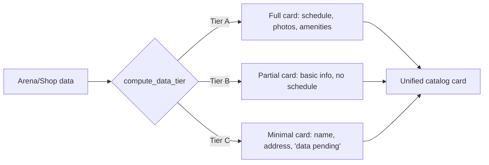
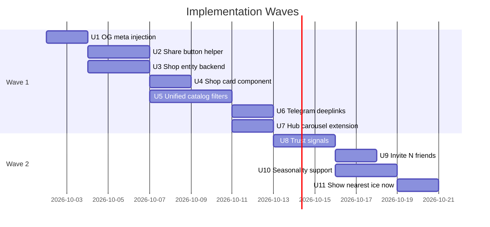

## Goal Capsule

**Objective:** The client catalog becomes a standalone viral platform for finding ice rinks, training venues, coaches, and shops across Belarus — working autonomously even with few registered trainers, shareable across Telegram/Viber/VK/WhatsApp, and accessible via direct deeplinks.

**Means:** Server-injected OG previews + share button on every card; new `venue_type=shop` entity on existing Arena/ArenaProfile; unified catalog UX with two-level filters; Telegram deeplinks extending the existing `arena_<slug>` pattern; hub carousel extension. Second wave adds trust signals, virality boost, and seasonality support.

**Authority hierarchy:** Product decisions (DEC-001…DEC-014) are session-settled and carry forward unchanged. Technical decisions in this plan are planning-time choices grounded in repo research.

**Stop conditions:** If research reveals the shop entity cannot reuse Arena/ArenaProfile without breaking existing arena functionality, stop and re-plan. If the unified catalog cannot coexist with the existing Ice tab without regression, stop and re-plan.

**Execution profile:** Two waves. Wave 1 delivers core virality + shop + unified catalog. Wave 2 delivers trust signals + virality boost + seasonality. Each wave is independently shippable.

**Tail ownership:** Wave 2 units depend on Wave 1 infrastructure (share helper, shop entity, unified filters). Do not start Wave 2 before Wave 1 is verified.

---

## Product Contract

### Summary

The client catalog (already public at `/api/public/*`) becomes a self-contained viral platform. Users discover ice rinks, gyms, coaches, and shops through a unified search; share cards via OG previews and multi-channel share dialogs; and arrive via Telegram deeplinks to filtered catalog views. The catalog degrades gracefully when data is sparse (Tier A/B/C), shows honest trust signals, and handles seasonality explicitly.

### Problem Frame

The catalog's architecture is ready for autonomy — public API open, static HTML shells ungated, data-tier degradation designed — but the viral surface is incomplete: no OG previews when sharing, share button only on trainer cards, no shop entity, no unified search across venue types, no deeplinks to filtered catalog views. The root domain `/` is given to a B2B trainer landing, not the client catalog. Without these, the catalog cannot function as a standalone discovery platform for users who arrive via shared links rather than through the Telegram bot.

### Requirements

**Sharing virality**

- R1. Public catalog pages (arena, trainer, shop cards) include server-injected OG meta tags (`og:title`, `og:image`, `ogdescription`) for link previews in Telegram/Viber/VK/WhatsApp.
- R2. OG tags render the entity's name, primary photo, and a short description. Missing or broken entity in the URL returns a default meta block with HTTP 200, never an error.
- R3. Every entity card (arena, trainer, shop) has a "Share" button that opens a multi-channel share dialog.
- R4. The share dialog offers four channels: Telegram (`t.me/share/url`), Copy link, Save image (for manual posting to Instagram/VK stories), and system share ("Other").
- R5. The share card uses a dark, dramatic visual style (9:16 story format, deep teal-to-black gradient) — the only place in the product with this treatment.
- R6. The share card has a toggle between "Schedule" and "Invite with me" tones.

**Shop entity**

- R7. A new venue type `shop` represents ice shops (retail + service: sharpening, rental, repair).
- R8. Shop entities reuse the existing `Arena`/`ArenaProfile` tables — no new table. Service tags (retail/sharpening/rental/repair) are stored in the existing `amenities` JSONB field as `dict[str, bool]`.
- R9. Shop creation and editing happen only through admin endpoints (`/admin/arenas*`). No public self-submission form.
- R10. Shop cards hide the mass skate schedule section and show service tags instead.
- R11. The "Shop" filter chip is disabled by default (opt-in, not opt-out).
- R12. Shop entities appear in the unified catalog search results alongside arenas, gyms, and coaches.

**Unified catalog UX**

- R13. The catalog uses a single search bar and a single filter set across all venue types (ice, gym, coach, shop).
- R14. Filters are two-level: (1) "What" — intent chips (`Skate`, `Coach`, `Gym`, `Shop`); (2) context row specific to each intent (days for skate, goal-scenarios for coach, service for shop, "open now" for gym/shop).
- R15. "Near me" is a persistent button inside the search row, not a chip in a scrollable row.
- R16. City is a separate picker in the header, not a filter chip.
- R17. The client tab "Trainers" is renamed to "Catalog".
- R18. The unified catalog replaces the separate per-type tabs (Ice / Coaches / Gyms as separate screens).

**Telegram deeplinks**

- R19. Direct deeplinks to filtered catalog views use the pattern `catalog_<city>[_<intent>]` (e.g., `catalog_minsk_skate`).
- R20. Deeplink handling extends the existing `maybeOpenArenaDeepLink()` pattern in `mini-app-client-shell.js`.
- R21. Fallback for unsupported payloads is the classic `/start` + button flow via `cmd_start`.

**Hub carousel**

- R22. The `hub-discovery` carousel in cold states shows mixed catalog cards (arenas, coaches, shops) instead of only trainers.
- R23. The carousel preserves the `is_country_fallback` contract from `get_hub_ice_teaser()`.
- R24. Clients with active bookings keep the booking-first hub; the carousel only appears in cold states.

**Trust signals (Wave 2)**

- R25. Cards without an owner account (arena, shop) show an "Updated N ago" timestamp.
- R26. Outdoor rinks show an honest "Depends on weather, check before going" label.
- R27. Cards show a data source label: "Added by team" vs "Confirmed by coach".

**Virality boost (Wave 2)**

- R28. A "Invite N friends" button is the primary action on hot slots (not hidden in an overlay).
- R29. Slot reminders via the bot work without separate registration.

**Seasonality and lazy scenario (Wave 2)**

- R30. The catalog default accounts for `ArenaProfile.season_start_month`/`season_end_month` — off-season venues show "Season closed" instead of an empty schedule.
- R31. Off-season venues remain visible in a dimmed state with an "Opens in [month]" label.
- R32. A "Show nearest ice now" shortcut button performs geolocation + today + nearest Tier A slot in one tap.

### Scope Boundaries

**In scope:** All requirements R1–R32 above.

**Deferred for later:**
- Public self-submission form for shop cards (moderation risk with no owner account).
- Full client hub redesign (booking-first behavior for engaged clients is preserved).
- Share button on every search result row in `ice-tab.js` (card-level share is sufficient).
- Parent/newbie signals (children tags, newbie checklist) — deprioritized, not rejected.
- Post-visit sharing format ("here's where I was") — different mechanics, separate track.
- SEO track (sitemap.xml, SPA indexability for Google/Yandex).
- Multi-language support (Belarusian/English).
- Legal/compliance track for personal data at national scale.
- Attribution/UTM for share links.
- "Smart default" time/intent algorithm (needs real user data).

**Outside this product's identity:**
- B2B trainer landing at `/` (separate audience, separate track).
- Trainer-side catalog management (different bot, different audience).

### Open Questions

- Q-006: What is the real algorithm for the "smart default" time/intent on catalog entry? (Deferred — needs real data)
- Q-007: Is attribution/UTM needed in share links? (Deferred — not blocking)
- Q-008: Legal/compliance at national scale? (Deferred — separate track)
- Q-009: Does the unified catalog read as "organic" to real users? (Deferred — user testing)
- Q-010: Multi-language support? (Deferred — separate track)
- Q-011: Post-visit sharing format? (Deferred — separate mechanics)
- Q-012: What updates the "Updated N ago" timestamp? (Deferred — implementation detail)
- Q-013: Where does the "Show nearest ice now" shortcut live? (Deferred — implementation detail)
- Q-014: Off-season venues: hidden or dimmed? (Deferred — implementation detail)

---

## Planning Contract

### Key Technical Decisions

- KTD1. **OG injection via server-side template rendering.** OG tags are injected into static HTML shells (`arena.html`, `catalog.html`, `ice.html`) at response time, following the `inject_landing_html` pattern in `src/api/app.py`. Social bots do not execute JS, so client-side generation does not solve the preview problem. (session-settled: user-directed — chosen over client-side generation: bots don't run JS)
- KTD2. **Shop reuses Arena/ArenaProfile with `venue_type=shop`.** No new table. Service tags go in the existing `amenities` JSONB field as `dict[str, bool]` (e.g., `{"retail": true, "sharpening": true, "rental": false}`). The `validate_amenities` function in `arena_profile.py` already validates this shape. (session-settled: user-directed — chosen over new table: reuses geo/media/moderation infrastructure)
- KTD3. **Share button as common helper.** Extract from `openTrainerShareDialog` (`catalog-main.js:3633`) into a reusable function in `mini-app-client-shell.js`. Attach to arena card. Do not add to search result rows — card-level share is sufficient. (session-settled: user-directed — chosen over per-card implementations: halves scope without losing coverage)
- KTD4. **Unified catalog replaces separate tabs.** One search, one filter set, common card framework. The existing Ice tab's intent chips (`skate`/`coach`) and `list_catalog_scenarios` goal-chips are the foundation. (session-settled: user-directed — chosen over hard tabs: one search across all types)
- KTD5. **Dark visual only in share card.** The share card is the only surface with dark/dramatic treatment (9:16 story, deep teal-to-black gradient). Main catalog UI stays light/calm. (session-settled: user-directed — chosen over extending to main UI: "darkness is an event, not a medium")
- KTD6. **Hub carousel extension, not full redesign.** Only `hub-discovery` in cold states changes. Booking-first hub for engaged clients is preserved. (session-settled: user-directed — chosen over full hub rebuild: don't touch working booking-first path)
- KTD7. **Deeplinks extend existing pattern.** `catalog_<city>[_<intent>]` extends `arena_<slug>` in `maybeOpenArenaDeepLink()`. Fallback to classic `/start` + button. (session-settled: user-directed — chosen over new mechanism: pattern already in prod)
- KTD8. **Two-level filters.** Intent chips (What) + context row (specific to each intent). "Near me" is a persistent button, not a chip. City is a header picker. (session-settled: user-directed — chosen over flat chip row: mixes axes, hides important modifier)
- KTD9. **Multi-channel sharing.** Four channels: Telegram, Copy link, Save image, system share. (session-settled: user-directed — chosen over Telegram-only: different circles use different messengers in Belarus)
- KTD10. **Shop visibility uses `arena_profiles.status`.** Shares don't have `catalog_state = 'published'` like trainers. The unified catalog reconciles two visibility models: trainers use `catalog_state`, shops use `arena_profiles.status` + `is_confirmed`.
- KTD11. **New router file for catalog endpoints.** `webapp.py` is 3000+ lines. New unified catalog endpoints go in a new router file (like `public_arenas.py` was split out), not appended to `webapp.py`.
- KTD12. **Shops need a separate query path.** The `_CURRENT_SESSION_SQL` gate in `arena_public_use_cases.py` filters by `ice_sessions` — shops without session rows never appear. Shops need a query path that doesn't depend on `ice_sessions`.
- KTD13. **Prototypes fix direction, not pixel-art.** Layout, icons, colors, copy, and field sets can be refined during implementation if real data or constraints reveal better requirements.

### High-Level Technical Design



**Data flow: share link lifecycle**



**Data tier degradation (existing pattern, extended to shops)**



### Assumptions

- Telegram client/bot configuration supports direct `startapp` links without intermediate message (based on existing `maybeOpenArenaDeepLink` code).
- The `amenities` JSONB field can store shop service tags without conflict with existing arena amenities (parking, cafe, etc.) — keys are namespaced by venue type.
- The `media` table's polymorphic `owner_type = 'arena'` covers shop photos without schema change.
- `arena_profiles.slug` city-unique constraint is sufficient for shop entities.
- The existing `ice_discovery_countries()` gate covers shop entities (Belarus-only scope).
- `record_client_share` fire-and-forget behavior is acceptable for share metrics (no retry needed for v1).

### Sequencing



---

## Implementation Units

### U1. OG meta tag injection for public catalog pages

**Goal:** Public catalog pages include server-injected OG meta tags for link previews in social messengers.

**Requirements:** R1, R2

**Dependencies:** None

**Files:**
- `src/api/app.py` (extend `inject_landing_html` or add new injection point)
- `src/api/routes/public.py` (pass entity data to templates)
- `src/api/routes/public_arenas.py` (pass arena data to templates)
- `static/webapp/arena.html` (add OG meta placeholders)
- `static/webapp/catalog.html` (add OG meta placeholders)
- `static/webapp/ice.html` (add OG meta placeholders)
- `tests/integration/test_public_og_meta.py` (new)

**Approach:**
1. Extend the existing `inject_landing_html` pattern to accept entity-specific data (name, photo URL, description).
2. Inject OG meta tags into the `<head>` of static HTML shells before response.
3. For missing/broken entities, return a default meta block (generic product name, logo, description) with HTTP 200.
4. Use the first published photo from the `media` table as `og:image`.
5. Follow the `webapp_client_payloads.py` pattern — pure functions, no DB access in builders.

**Test scenarios:**
- Arena page with valid slug returns 200 with correct `og:title`, `og:image`, `og:description`.
- Arena page with invalid slug returns 200 with default meta block (no error).
- Trainer page with valid ID returns 200 with trainer name and photo.
- Trainer page with invalid ID returns 200 with default meta block.
- Shop page with valid slug returns 200 with shop name and photo.
- OG meta tags are present in raw HTML (not JS-rendered) — verify by parsing response HTML without executing JS.

**Verification:** All tests pass. OG tags visible in `curl` response without JS execution.

---

### U2. Share button helper + multi-channel share dialog

**Goal:** Every entity card has a "Share" button that opens a multi-channel share dialog with a dark, dramatic share card.

**Requirements:** R3, R4, R5, R6

**Dependencies:** None (parallel with U1)

**Files:**
- `static/webapp/mini-app-client-shell.js` (extract share helper)
- `static/webapp/arena-card.js` (attach share button)
- `static/webapp/catalog-main.js` (refactor trainer share to use helper)
- `static/webapp/mini-app-telegram-chrome.js` (use existing `openTelegramShareUrlFromMiniApp`)
- `static/webapp/mini-app-arena-ribbon.css` (share card styles)
- `tests/e2e/test_share_dialog.py` (new)

**Approach:**
1. Extract the share logic from `openTrainerShareDialog` (`catalog-main.js:3633`) into a reusable `openShareDialog(entityType, entityData)` function in `mini-app-client-shell.js`.
2. Build the share card as a 9:16 story-format overlay with deep teal-to-black gradient.
3. Add a toggle between "Schedule" and "Invite with me" tones.
4. Four channels: Telegram (`t.me/share/url`), Copy link (`navigator.clipboard`), Save image (canvas export), system share (`navigator.share`).
5. Attach the share button to `arena-card.js` — same pattern as trainer card.
6. Refactor `catalog-main.js` trainer share to use the new helper (no behavior change).
7. Follow the `openTelegramShareUrlFromMiniApp` signature: `{shareUrl, shareBody, fullMessage}`.

**Test scenarios:**
- Arena card shows "Share" button.
- Tapping "Share" opens the dialog with 4 channel options.
- Telegram option opens `t.me/share/url` with correct URL and text.
- Copy option copies the URL to clipboard.
- Save option exports the share card as an image.
- System share option invokes `navigator.share` (where available).
- Share card renders in dark 9:16 format.
- Toggle between "Schedule" and "Invite with me" changes the card text.
- Trainer card share still works after refactor (regression).

**Verification:** All tests pass. Share dialog opens on arena, trainer, and shop cards.

---

### U3. Shop entity backend (venue_type=shop)

**Goal:** New `venue_type=shop` entity reuses Arena/ArenaProfile, with admin-only CRUD and service tags in `amenities`.

**Requirements:** R7, R8, R9, R12

**Dependencies:** None (parallel with U1, U2)

**Files:**
- `src/infrastructure/db/models.py` (extend `venue_types.py` or equivalent)
- `src/application/arena_profile.py` (extend `validate_amenities` for shop services)
- `src/api/routes/admin.py` (extend `/admin/arenas*` for shop CRUD)
- `src/api/routes/public.py` (add shop query path)
- `src/application/arena_public_use_cases.py` (add shop listing logic)
- `tests/integration/test_shop_entity.py` (new)

**Approach:**
1. Add `'shop'` to the venue type enum in `venue_types.py`.
2. Extend `validate_amenities` in `arena_profile.py` to accept shop service keys (`retail`, `sharpening`, `rental`, `repair`) — same `dict[str, bool]` shape.
3. Admin endpoints: extend `/admin/arenas*` to accept `venue_type=shop` and service tags. No new router needed.
4. Public query path: shops don't have `ice_sessions` rows, so they need a separate query that doesn't go through `_CURRENT_SESSION_SQL`. Add a `get_shops()` function in `arena_public_use_cases.py` that queries `arena_profiles` with `venue_type=shop` and `is_confirmed=true`.
5. Shop visibility uses `arena_profiles.status` (not `catalog_state` like trainers).
6. Slug allocation reuses `allocate_arena_slug()` — shops get city-unique slugs.
7. Media: shop photos use `owner_type='arena'` in the `media` table (no schema change).

**Test scenarios:**
- Admin can create a shop with `venue_type=shop` and service tags.
- Admin can edit shop service tags.
- Shop appears in public API with correct service tags.
- Shop without `ice_sessions` rows appears in the shop listing (not filtered out by `_CURRENT_SESSION_SQL`).
- Shop with `is_confirmed=false` does not appear in public listing.
- Shop slug is city-unique (collision appends district/id).
- Shop photos are retrievable via `media` table with `owner_type='arena'`.
- Non-shop venue types are unaffected by shop changes (regression).

**Verification:** All tests pass. Shops CRUD works in admin. Shops appear in public API.

---

### U4. Shop card component

**Goal:** Shop cards reuse the arena card framework, hide the mass skate section, and show service tags.

**Requirements:** R10, R11

**Dependencies:** U3

**Files:**
- `static/webapp/arena-card.js` (extend for shop variant)
- `static/webapp/mini-app-arena-ribbon.css` (shop card styles)
- `tests/e2e/test_shop_card.py` (new)

**Approach:**
1. Extend `arena-card.js` to accept `venue_type=shop` and render a shop-specific variant.
2. Hide the mass skate schedule section for shops.
3. Show service tags from `amenities` as icon tiles (retail/sharpening/rental/repair).
4. Use the color rail (left 3px border) with a shop-specific color.
5. The "Shop" filter chip is disabled by default — shops appear in results only when the user explicitly selects the shop filter.
6. Follow the existing card framework: icon badge + color rail + title + secondary line + type-specific sections.

**Test scenarios:**
- Shop card renders with service tags (retail/sharpening/rental/repair icons).
- Shop card hides the mass skate schedule section.
- Shop card shows the correct color rail for shop type.
- Shop card appears in catalog results only when shop filter is selected.
- Shop card links to the correct public URL.
- Shop card shows "Share" button (from U2).

**Verification:** All tests pass. Shop cards render correctly in the catalog.

---

### U5. Unified catalog filters (two-level)

**Goal:** The catalog uses a single search bar with two-level filters: intent chips + context row.

**Requirements:** R13, R14, R15, R16, R17, R18

**Dependencies:** U2 (share helper), U3 (shop entity)

**Files:**
- `static/webapp/ice-tab.js` (extend filter model)
- `static/webapp/ice-tab-model.js` (extend intent chips)
- `static/webapp/catalog-main.js` (rename tab to "Catalog")
- `static/webapp/client-home.html` (update tab label)
- `src/application/catalog_use_cases.py` (extend `list_catalog_scenarios` for shop services)
- `tests/e2e/test_unified_filters.py` (new)

**Approach:**
1. Extend `ice-tab-model.js` to support four intents: `skate`, `coach`, `gym`, `shop`.
2. First level: intent chips (`Skate` / `Coach` / `Gym` / `Shop`) — equal-weight entries.
3. Second level: context row specific to each intent:
   - `skate`: day chips (today, tomorrow, weekend)
   - `coach`: goal-scenarios from `list_catalog_scenarios` (e.g., "Improve skating", "From zero")
   - `gym`: "Open now" toggle
   - `shop`: service chips (retail/sharpening/rental/repair)
4. "Near me" is a persistent button inside the search row (not a chip).
5. City is a separate picker in the header.
6. Rename the client tab from "Trainers" to "Catalog" in `client-home.html` and `catalog-main.js`.
7. The unified catalog replaces separate per-type tabs — the Ice tab becomes the Catalog tab.
8. Follow the existing smart fallback: if the selected intent has no results, switch to one that does (pattern from `ice-tab-model.js:215-219`).

**Test scenarios:**
- Four intent chips are visible: Skate, Coach, Gym, Shop.
- Selecting "Skate" shows day chips in the context row.
- Selecting "Coach" shows goal-scenario chips.
- Selecting "Shop" shows service chips.
- Selecting "Gym" shows "Open now" toggle.
- "Near me" button is always visible in the search row.
- City picker is in the header, not in the filter row.
- Tab is renamed to "Catalog".
- Smart fallback: selecting an intent with no results switches to one with results.
- Filter state persists across tab switches (uses `client_sessions` table).

**Verification:** All tests pass. Unified filters work across all four intent types.

---

### U6. Telegram deeplinks for catalog

**Goal:** Direct deeplinks to filtered catalog views extend the existing `arena_<slug>` pattern.

**Requirements:** R19, R20, R21

**Dependencies:** U5 (unified filters)

**Files:**
- `static/webapp/mini-app-client-shell.js` (extend `maybeOpenArenaDeepLink`)
- `src/api/routes/client_handlers.py` (extend `cmd_start` payload parsing)
- `tests/integration/test_catalog_deeplinks.py` (new)

**Approach:**
1. Extend `maybeOpenArenaDeepLink()` in `mini-app-client-shell.js` to recognize `catalog_<city>[_<intent>]` payloads.
2. Parse the payload: extract city slug and optional intent (`skate`, `coach`, `gym`, `shop`).
3. Navigate to the catalog URL with the appropriate filter pre-applied.
4. Fallback: if the payload is malformed or the city is unknown, fall back to the classic `/start` + button flow via `cmd_start`.
5. Follow the existing pattern: `arena_<slug>` → `arena?ref=<slug>`, so `catalog_minsk_skate` → `catalog?city=minsk&intent=skate`.
6. The `cmd_start` function in `client_handlers.py` already parses a dozen payload formats — add `catalog_*` to the recognized patterns.

**Test scenarios:**
- `catalog_minsk` payload navigates to catalog with Minsk pre-selected.
- `catalog_minsk_skate` payload navigates to catalog with Minsk + skate intent.
- `catalog_minsk_shop` payload navigates to catalog with Minsk + shop intent.
- Malformed payload falls back to `/start`.
- Unknown city falls back to `/start`.
- Existing `arena_<slug>` deeplinks still work (regression).
- Deeplink works from a shared link (not just from bot button).

**Verification:** All tests pass. Deeplinks navigate to correct catalog views.

---

### U7. Hub carousel extension

**Goal:** The `hub-discovery` carousel shows mixed catalog cards in cold states, preserving the `is_country_fallback` contract.

**Requirements:** R22, R23, R24

**Dependencies:** U5 (unified catalog)

**Files:**
- `static/webapp/client-home.html` (extend `hub-discovery`)
- `static/webapp/client-home-main.js` (extend carousel logic)
- `src/application/arena_public_use_cases.py` (extend `get_hub_ice_teaser` or add `get_hub_catalog`)
- `tests/integration/test_hub_carousel.py` (new)

**Approach:**
1. Extend `get_hub_ice_teaser()` or add a new `get_hub_catalog()` function that returns mixed cards (arenas, coaches, shops).
2. Preserve the `is_country_fallback` flag — when `city_id=None`, the function does a country-wide fallback and sets the flag.
3. The carousel shows in cold states only (matrix from `client-home-main.js:1555-1557`).
4. Clients with active bookings keep the booking-first hub — the carousel is not shown.
5. Cards in the carousel link to the unified catalog with the appropriate filter pre-applied.
6. Follow the existing pattern: `ice_teaser` cold-start contract with `is_country_fallback`.

**Test scenarios:**
- Cold-state hub shows mixed catalog cards (arenas, coaches, shops).
- `is_country_fallback` flag is set when `city_id=None`.
- Carousel is not shown for clients with active bookings.
- Carousel cards link to the correct catalog view.
- Carousel respects `ice_discovery_countries()` gate.
- Existing `ice_teaser` behavior is unchanged (regression).

**Verification:** All tests pass. Hub carousel shows mixed cards in cold states.

---

### U8. Trust signals

**Goal:** Cards without an owner account show honest trust signals: update timestamp, weather dependency, and data source.

**Requirements:** R25, R26, R27

**Dependencies:** U5 (unified catalog)

**Files:**
- `static/webapp/arena-card.js` (add trust signal elements)
- `src/application/arena_public_use_cases.py` (expose `verified_at` and source metadata)
- `tests/integration/test_trust_signals.py` (new)

**Approach:**
1. Add an "Updated N ago" timestamp to cards where the entity has no owner account (arena, shop). Use `verified_at` or `updated_at` from `arena_profiles`.
2. Add a "Depends on weather, check before going" label for outdoor rinks (`venue_type=outdoor`).
3. Add a data source label: "Added by team" (admin-created) vs "Confirmed by coach" (owner-verified).
4. Follow the existing pattern: `verified_at` is already in `arena_profiles` and exposed in `arena_public_use_cases.py`.
5. The timestamp format is relative ("2 hours ago", "3 days ago") — compute on the server or use a client-side relative time formatter.

**Test scenarios:**
- Arena card without owner shows "Updated N ago" timestamp.
- Arena card with owner shows "Confirmed by coach" label.
- Admin-created shop shows "Added by team" label.
- Outdoor rink shows "Depends on weather" label.
- Indoor arena does not show weather label.
- Timestamp is relative and human-readable.

**Verification:** All tests pass. Trust signals render correctly on all card types.

---

### U9. "Invite N friends" button

**Goal:** A primary "Invite N friends" button on hot slots, with a distinct metric from share events.

**Requirements:** R28, R29

**Dependencies:** U2 (share helper)

**Files:**
- `static/webapp/slot-card.js` (add invite button)
- `src/application/client_delight_metrics.py` (add invite metric)
- `tests/integration/test_invite_friends.py` (new)

**Approach:**
1. Add an "Invite N friends" button as the primary action on hot slots (not hidden in an overlay).
2. The button opens the share dialog (from U2) with the "Invite with me" tone pre-selected.
3. Add a distinct metric for invites: `client_share_events` with `kind='invite'` (separate from `kind='share'`).
4. The `actor_hash` for invites should use a different salt or token to count distinct inviters (not just shares).
5. Slot reminders via the bot: extend the existing reminder mechanism to work without separate registration (use the existing `client_sessions` table to track reminder preferences).

**Test scenarios:**
- Hot slot shows "Invite N friends" as the primary button.
- Tapping the button opens the share dialog with "Invite with me" tone.
- Invite metric is recorded separately from share metric.
- Multiple invites from the same user count as one inviter (distinct by day).
- Slot reminder is sent via the bot without separate registration.
- Reminder respects the user's timezone.

**Verification:** All tests pass. Invite button works and metrics are recorded.

---

### U10. Seasonality support

**Goal:** The catalog default accounts for seasonality — off-season venues show "Season closed" instead of an empty schedule.

**Requirements:** R30, R31

**Dependencies:** U5 (unified catalog)

**Files:**
- `src/application/arena_public_use_cases.py` (add seasonality check)
- `static/webapp/arena-card.js` (show season closed state)
- `static/webapp/ice-tab-model.js` (seasonality-aware default)
- `tests/integration/test_seasonality.py` (new)

**Approach:**
1. Read `season_start_month` and `season_end_month` from `ArenaProfile`.
2. If the current month is outside the season range, the venue is "off-season".
3. Off-season venues show a "Season closed" message instead of an empty schedule.
4. Off-season venues remain visible in a dimmed state with an "Opens in [month]" label.
5. The catalog default filter excludes off-season venues from the default view (but they're visible when explicitly searched).
6. Follow the existing pattern: `compute_data_tier()` already handles data completeness — seasonality is a separate dimension.

**Test scenarios:**
- Arena within season shows normal schedule.
- Arena outside season shows "Season closed" message.
- Off-season arena is dimmed with "Opens in [month]" label.
- Off-season arena is excluded from default catalog view.
- Off-season arena appears when explicitly searched.
- Season boundary: first day of season start month is "in season".
- Season boundary: last day of season end month is "in season".

**Verification:** All tests pass. Seasonality is handled correctly.

---

### U11. "Show nearest ice now" shortcut

**Goal:** A one-tap shortcut that finds the nearest ice rink with available slots today.

**Requirements:** R32

**Dependencies:** U5 (unified catalog), U10 (seasonality)

**Files:**
- `static/webapp/ice-tab.js` (add shortcut button)
- `src/application/arena_public_use_cases.py` (add nearest-ice query)
- `tests/integration/test_nearest_ice.py` (new)

**Approach:**
1. Add a "Show nearest ice now" button in the hero section next to the search bar.
2. On tap: request geolocation → find nearest Tier A arena with active public skate slots today → navigate to that arena's card.
3. If geolocation is denied, fall back to the city picker.
4. If no slots are found today, show the nearest arena with slots tomorrow.
5. Follow the existing pattern: `ice_discovery_countries()` gate, `_CURRENT_SESSION_SQL` filter for active slots.
6. The shortcut is a convenience wrapper around the existing catalog query — not a new query engine.

**Test scenarios:**
- Button is visible in the hero section.
- Tapping the button requests geolocation.
- With geolocation granted, navigates to nearest arena with slots today.
- With geolocation denied, falls back to city picker.
- With no slots today, shows nearest arena with slots tomorrow.
- With no slots at all, shows an honest empty state.
- Shortcut respects `ice_discovery_countries()` gate.

**Verification:** All tests pass. Shortcut navigates to nearest ice correctly.

---

## Verification Contract

**Test framework:** pytest (async support via `pytest-asyncio`)

**Run all tests:**
```bash
python -m pytest tests/ -v
```

**Run integration tests:**
```bash
python -m pytest tests/integration/ -v
```

**Run e2e tests:**
```bash
python -m pytest tests/e2e/ -v
```

**Run specific unit tests:**
```bash
python -m pytest tests/integration/test_public_og_meta.py -v
python -m pytest tests/e2e/test_share_dialog.py -v
python -m pytest tests/integration/test_shop_entity.py -v
python -m pytest tests/e2e/test_shop_card.py -v
python -m pytest tests/e2e/test_unified_filters.py -v
python -m pytest tests/integration/test_catalog_deeplinks.py -v
python -m pytest tests/integration/test_hub_carousel.py -v
python -m pytest tests/integration/test_trust_signals.py -v
python -m pytest tests/integration/test_invite_friends.py -v
python -m pytest tests/integration/test_seasonality.py -v
python -m pytest tests/integration/test_nearest_ice.py -v
```

**Quality gates:**
- All new tests pass.
- No regression in existing public API tests.
- No regression in existing catalog/hub tests.
- Type checking passes (`mypy src/` or equivalent).
- Linting passes (`ruff check src/` or equivalent).

---

## Definition of Done

**Global:**
- All 11 implementation units complete and verified.
- All new tests pass.
- No regression in existing functionality.
- Type checking and linting pass.
- Plan is ready for `ce-work` execution.

**Per-unit done criteria:**

| Unit | Done when |
|------|-----------|
| U1 | OG meta tags present in raw HTML for all public catalog pages; missing entities return default meta with 200 |
| U2 | Share button on arena, trainer, and shop cards; 4-channel dialog works; dark 9:16 share card renders |
| U3 | Shops CRUD in admin; shops appear in public API; service tags stored in amenities |
| U4 | Shop cards render with service tags; mass skate section hidden; color rail correct |
| U5 | Four intent chips work; context row changes per intent; "Near me" is persistent; tab renamed to "Catalog" |
| U6 | `catalog_<city>[_<intent>]` deeplinks navigate correctly; fallback to `/start` works |
| U7 | Hub carousel shows mixed cards in cold states; `is_country_fallback` preserved |
| U8 | "Updated N ago" on ownerless cards; weather label on outdoor rinks; source label correct |
| U9 | "Invite N friends" is primary on hot slots; invite metric distinct from share metric |
| U10 | Off-season venues show "Season closed"; dimmed with "Opens in [month]" |
| U11 | "Show nearest ice now" navigates to nearest arena with slots today |

**Cleanup criterion:** All dead-end code, experimental approaches, and debugging artifacts are removed before the plan is declared done. Only the final implementation remains in the diff.
